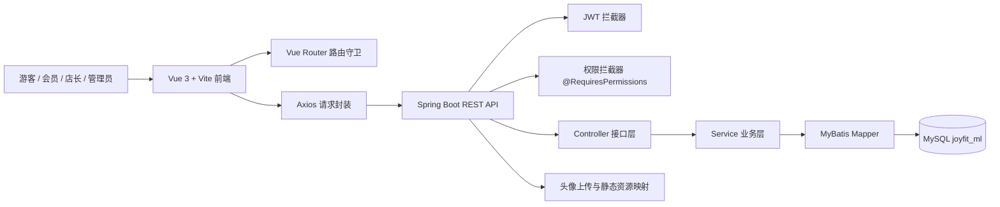
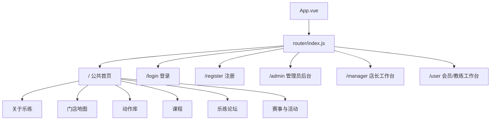

# JoyFit 乐练健身管理系统

JoyFit 是一个面向连锁健身门店的前后端分离管理系统，覆盖官网展示、会员注册登录、门店查询、动作库、课程库、论坛互动、个人中心、店长排课与管理员后台数据维护等场景。项目包含 Spring Boot 后端、Vue 3 前端、MySQL 数据库脚本，以及完整的 UML、原型图和测试截图资料。


## 项目定位

本系统以“乐练 LeLian”健身品牌为业务背景，将游客、会员、教练、店长和管理员分为不同角色，围绕健身门店运营中的内容展示、用户档案、课程动作、门店排课、社区互动和后台主数据维护建立一套完整的信息化系统。

核心目标包括：

- 为游客提供品牌首页、门店地图、课程库、动作库、论坛和赛事活动浏览入口。
- 为会员提供注册登录、个人资料、头像上传、动作收藏、课程收藏、论坛发帖评论点赞等能力。
- 为店长提供同门店人员查看、会员资料维护、门店课程排期、课程与动作浏览、论坛互动等能力。
- 为管理员提供用户、角色相关人员、标语、活动、门店、省份、动作、课程等基础数据的统一维护入口。
- 通过 JWT、RBAC 权限表和 MVC 拦截器完成登录态与角色权限控制。

## 技术栈

| 层级 | 技术 | 说明 |
| --- | --- | --- |
| 后端 | Java 17、Spring Boot 3、Spring MVC | REST API 服务与业务接口 |
| 持久层 | MyBatis、MyBatis XML Mapper | 实体映射、条件查询、CRUD 操作 |
| 数据库 | MySQL、InnoDB、utf8mb4 | 20 张业务表，覆盖账号、门店、课程、动作、论坛等 |
| 安全 | Spring Security、JWT、BCrypt、RBAC | 密码加密、Token 登录态、权限码校验 |
| 前端 | Vue 3、Vite、Vue Router | 单页应用、多角色工作台 |
| UI 与请求 | Element Plus、Axios、Sass | 表单、表格、弹窗、请求拦截与错误处理 |
| 工具与文档 | Maven、npm、UML、Visio、Markdown | 项目构建、数据库脚本、设计图与分析报告 |

## 仓库结构

```text
JoyFit_ml
├── JoyFit/                 # Spring Boot 后端项目
│   ├── src/main/java/com/joyfit
│   │   ├── config/         # CORS、JWT、权限拦截、MyBatis、Security 配置
│   │   ├── controller/     # Auth、Index、Admin、Manager、Member、Profile、Upload 控制器
│   │   ├── domain/         # Entity、DTO、VO
│   │   ├── mapper/         # MyBatis Mapper 接口
│   │   ├── service/        # Service 接口与实现
│   │   └── utils/          # Result、JWT、异常处理、权限注解、用户上下文等
│   └── src/main/resources
│       ├── application.yml # 后端运行配置
│       └── mapper/         # MyBatis XML SQL 映射
├── JoyFit_Vue3/            # 主要 Vue 3 前端实现
│   └── src/views
│       ├── 00auth/         # 登录、注册
│       ├── 01index/        # 游客首页六大内容模块
│       ├── 11admin/        # 管理员后台
│       ├── 12manager/      # 店长工作台
│       └── 13member/       # 会员工作台
├── JoyFit_Vue_new/         # 另一套 Vue 前端迭代版本及构建产物
├── JoyFit_Sql/             # DDL、RBAC、初始化数据脚本
├── JoyFit_Uml/             # 原型图、用例图、时序图、活动图、ER 图、测试截图
└── JoyFit_Md/              # 后端、前端、SQL、测试、核心代码分析报告
```

## 系统架构



后端以 `/api/**` 作为接口前缀。公开首页接口位于 `/api/index/**`，登录注册位于 `/api/auth/**`；管理员、店长、会员和个人中心接口通过 JWT 与权限码进行保护。前端根据 `roleId` 将登录用户分发到 `/admin`、`/manager` 或 `/user` 工作台。

## 功能模块

### 游客端

| 模块 | 主要功能 | 后端接口 |
| --- | --- | --- |
| 首页标语 | 品牌介绍、Slogan 展示 | `GET /api/index/slogans` |
| 门店地图 | 省份切换、门店列表、经纬度定位、门店类型筛选 | `GET /api/index/provinces`、`GET /api/index/stores` |
| 动作库 | 动作分类、难度筛选、分页浏览 | `GET /api/index/action-categories`、`GET /api/index/actions` |
| 课程库 | 课程分类、难度筛选、课程详情展示 | `GET /api/index/course-categories`、`GET /api/index/courses` |
| 乐练论坛 | 公共帖子列表、评论与点赞昵称展示 | `GET /api/index/forum/posts` |
| 赛事活动 | 活动列表、日期、地点、报名人数展示 | `GET /api/index/activities` |

### 认证与个人中心

| 模块 | 主要功能 |
| --- | --- |
| 注册 | 用户名、密码、手机号注册，默认注册为会员角色 |
| 登录 | BCrypt 密码校验，返回 JWT、用户 ID、用户名和角色 ID |
| Token 刷新 | 根据有效 Token 生成新 Token |
| 退出登录 | 将 Token 写入内存黑名单 |
| 个人资料 | 查询与修改个人档案、身高体重、头像、简介、会员期限 |
| 头像上传 | Multipart 上传，静态资源通过 `/avatar/**` 与 `/uploads/avatar/**` 访问 |

### 会员工作台

| 模块 | 主要功能 |
| --- | --- |
| 个人中心 | 查看和修改账号资料、头像、手机号、密码、会员档案 |
| 动作收藏 | 收藏或取消收藏动作，查看个人收藏动作列表 |
| 课程收藏 | 收藏或取消收藏课程，查看个人收藏课程列表 |
| 门店信息 | 查看所属门店与门店课程排期 |
| 论坛互动 | 发帖、评论、点赞或取消点赞 |
| 公共内容 | 登录后仍可访问首页、门店、动作库、课程、活动等公共模块 |

### 店长工作台

| 模块 | 主要功能 |
| --- | --- |
| 我的门店 | 查询自己管理的门店、同店会员和教练 |
| 会员维护 | 修改同店用户手机号、密码、会员卡开卡与到期信息 |
| 门店排课 | 新增、修改、删除门店课程排期，绑定课程、教练、日期、时间和容量 |
| 内容浏览 | 访问动作库、课程库、论坛、赛事活动等公共内容 |
| 论坛互动 | 以店长身份发帖、评论、点赞或取消点赞 |

### 管理员后台

| 业务域 | 管理内容 |
| --- | --- |
| 用户与档案 | 管理员、店长、会员、教练账号及扩展档案 |
| 标语与活动 | 首页 Slogan、赛事活动 |
| 门店数据 | 省份区域、门店基础信息、营业状态、经纬度 |
| 动作数据 | 动作分类、动作名称、难度、图片、描述 |
| 课程数据 | 课程分类、课程名称、难度、时长、图片、描述 |
| 通用能力 | 分页查询、新增、编辑、删除、详情弹窗、图片上传 |

## 角色与权限

| 角色 ID | 角色代码 | 角色名称 | 前端入口 | 权限码 |
| --- | --- | --- | --- | --- |
| 1 | `ADMIN` | 管理员 | `/admin` | `admin:select`、`profile:all` |
| 2 | `MANAGER` | 店长 | `/manager` | `manager:select`、`profile:all` |
| 3 | `USER` | 会员 | `/user` | `member:select`、`profile:all` |
| 4 | `COACH` | 教练 | `/user` | `member:select`、`profile:all` |

权限数据由 `sys_permission`、`sys_role`、`sys_role_permission` 和 `sys_user` 支撑。后端通过 `@RequiresPermissions` 标注控制器或方法，`PermissionInterceptor` 从 `UserContext` 读取当前用户 ID，再查询权限表判断是否允许访问。

## 数据库设计

数据库默认名称为 `joyfit_ml`，字符集为 `utf8mb4`。表结构主要分为五个业务域：

| 业务域 | 数据表 |
| --- | --- |
| 账号与权限 | `sys_user`、`sys_user_profile`、`sys_role`、`sys_permission`、`sys_role_permission` |
| 首页内容 | `t_slogan_info`、`t_activity_event` |
| 门店业务 | `t_store_province`、`t_store`、`y_user_store` |
| 课程业务 | `t_course_category`、`t_course`、`y_user_course_favorite`、`t_store_course_schedule` |
| 动作业务 | `t_action_category`、`t_action`、`y_user_action_favorite` |
| 论坛互动 | `t_forum_post`、`t_forum_comment`、`t_forum_like` |


## 接口概览

| 控制器 | 前缀 | 说明 |
| --- | --- | --- |
| `AuthController` | `/api/auth` | 注册、登录、刷新 Token、退出登录 |
| `IndexController` | `/api/index` | 首页公共数据、门店、课程、动作、论坛、活动 |
| `AdminController` | `/api/admin` | 管理员后台用户、标语、活动、门店、动作、课程 CRUD |
| `ManagerController` | `/api/manager` | 店长侧同店人员、收藏、论坛、排课管理 |
| `MemberController` | `/api/member` | 会员侧收藏、门店课程、论坛互动 |
| `UserProfileController` | `/api/user/profile` | 个人资料、聚合用户信息、收藏与论坛记录 |
| `UploadController` | `/upload` | 图片上传 |

统一响应结构：

```json
{
  "code": 200,
  "message": "Query success",
  "data": {},
  "timestamp": "2026-05-22T10:00:00"
}
```

## 前端页面结构



`JoyFit_Vue3` 是当前主要前端目录，采用单页应用结构。游客首页不是多个独立路由，而是在同一个页面壳中切换六个内容组件；登录后根据角色进入对应工作台，工作台内部同样通过动态组件切换功能页。

## 快速启动

### 1. 准备环境

- JDK 17
- Maven 3.8+
- Node.js 20.19+ 或 22.12+
- MySQL 8.x

### 2. 初始化数据库

```sql
source JoyFit_Sql/ddl.sql;
source JoyFit_Sql/data1_RBAC.sql;
source JoyFit_Sql/insert.sql;
```

如本地数据库账号、密码或库名不同，请修改：

```text
JoyFit/src/main/resources/application.yml
```

默认后端连接：

```yaml
spring:
  datasource:
    url: jdbc:mysql://localhost:3306/joyfit_ml?useUnicode=true&characterEncoding=utf8&serverTimezone=Asia/Shanghai
    username: root
```

### 3. 启动后端

```bash
cd JoyFit
./mvnw spring-boot:run
```

后端默认运行在：

```text
http://localhost:8080
```

### 4. 启动前端

```bash
cd JoyFit_Vue3
npm install
npm run dev
```

Vite 默认运行在：

```text
http://localhost:5173
```

### 5. 默认账号

初始化脚本提供了以下演示账号，密码哈希由 BCrypt 存储；实际明文密码以课程/部署说明为准，如无法登录可通过注册接口创建新会员，或在后端使用 `PasswordEncoderUtil` 重新生成密码哈希。

| 用户名 | 角色 |
| --- | --- |
| `admin` | 管理员 |
| `manager` | 店长 |
| `user` | 会员 |
| `coach` | 教练 |

## 项目亮点

- 前后端分离清晰，后端提供 REST API，前端使用 Vue Router 做角色页面分发。
- 具备较完整的 RBAC 权限模型，角色、权限、角色权限关系独立建表。
- 首页公共内容、会员工作台、店长工作台、管理员后台覆盖了健身门店管理的核心流程。
- 管理员后台采用配置驱动思路统一维护多类资源，减少重复 CRUD 页面。
- 论坛模块包含帖子、评论、点赞聚合展示，交互闭环完整。
- 门店排课模型覆盖门店、课程、教练、日期、时间、容量和状态，适合健身业务演示。
- UML、原型图、ER 图和测试截图资料齐全，便于论文、答辩、汇报和二次开发。

## 相关文档

更细的项目分析位于 `JoyFit_Md`：

- `JoyFit_Md/JoyFit_后端项目深度分析报告.md`
- `JoyFit_Md/JoyFit_前端项目深度分析报告.md`
- `JoyFit_Md/JoyFit_SQL数据库设计分析报告.md`
- `JoyFit_Md/JoyFit_系统测试章节草稿.md`
- `JoyFit_Md/JoyFit_论文核心代码实现分析.md`

## 目录中的设计资产

| 目录 | 内容 |
| --- | --- |
| `JoyFit_Uml/原型图` | 首页、登录、注册、会员中心、论坛、门店、管理员、店长排课等界面原型 |
| `JoyFit_Uml/用例图` | 顶层用例、认证授权、公共内容、管理员、店长、会员用例 |
| `JoyFit_Uml/时序图` | 注册、登录、刷新 Token、头像、收藏、论坛、点赞、排课等流程 |
| `JoyFit_Uml/活动图` | 用户认证、收藏切换、评论、点赞、门店排课等业务活动 |
| `JoyFit_Uml/E-R 图` | 数据库实体关系图 |
| `JoyFit_Uml/测试图` | 主要功能测试截图 |
| `JoyFit_Uml/Visio` | 可继续编辑的 Visio 源文件 |


## GitHub 链接

https://github.com/Mrtx233/JoyFit_ml
